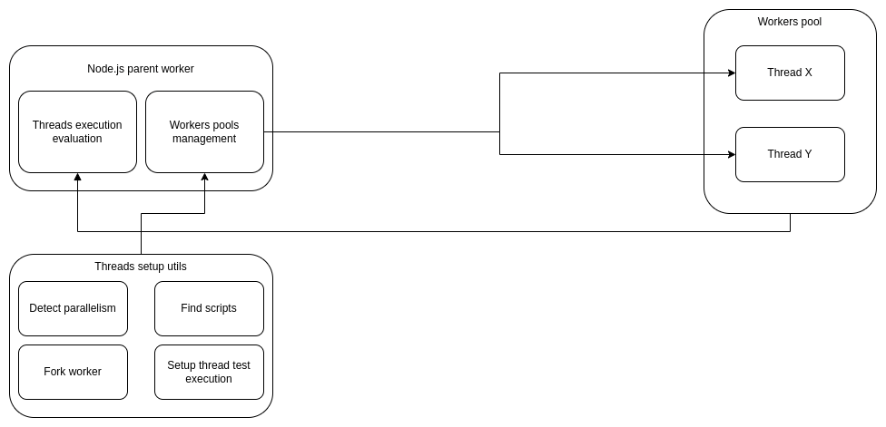

# warthog-load-testing

That is a library developed in <a href="https://nodejs.org">Node.js</a> based on <a href="https://nodejs.org/api/worker_threads.html">worker_threads</a> native feature to be able to do load tests through compatible scripts.

Some load test scripts already developed can be found in the `examples` folder.



## Configuration

```bash
cp .env.sample .env
```

Then you would be able edit `.env` for configuring your scripts running environment.

## Writing scripts

The scripts are going to be executed in the `node` runtime and need to have two functions exported.

In the `./examples/redis/redis.js` script you can easily see what this is like.

## Development

It is necessary to have <a href="https://www.docker.com/">Docker</a> installed to be able to run the tests.

```bash
pnpm run test
```