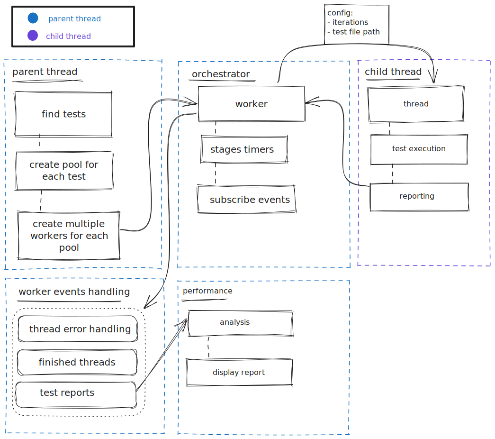

# Warthog

:warning: This project is still under development :warning:

<a href="https://github.com/onebeyond/warthog-load-testing">**_Warthog_**</a> is a powerful tool to launch your <a href="https://en.wikipedia.org/wiki/Load_testing#Software_load_testing">**load tests**</a> without any kind of limitation when it comes to choosing the level of load or the types of resources you want to test.

Key features:

-   **Friendly**: It is developed to provide the greatest possible simplicity to developers.
-   **Familiar**: The tests needs to be created by using <a href="https://developer.mozilla.org/en-US/docs/Learn/JavaScript/First_steps/What_is_JavaScript">JavaScript</a>, which is a versatile and widely-used programming language.
-   **Simplicity**: The tests are executed under the <a href="https://nodejs.org">Node.js</a> runtime, which offers a robust ecosystem, efficient performance, and extensive libraries, simplifying the development process.
-   **Performance**: Optimized to reduce latencies when calculating the test suite scores.
-   **Limitless**: It supports **any protocol** that the <a href="https://nodejs.org/api/all.html">runtime allows</a>, you don't need to extend anything.

## Principles

- **Measure performance** between **future versions** of this framework to observe that **performance does not worsen**. The new features cannot decrease the total number of iterations that could be executed before. This could lead to misunderstandings since it could lead to the conclusion that the system that the end user is testing has worsened its performance. When it really is not like that, what has happened is that its iterations take longer to execute due to a worsening in the framework runtime during the same tasks during each execution.

## Examples

There is an already developed <a href="https://github.com/onebeyond/warthog-load-testing">**_Warthog_**</a> project full of load test scripts already developed. That one can be found under the <a href="https://github.com/onebeyond/warthog-load-testing/tree/main/example">example</a> folder of this repository.

The tool is ready for being integrated with a continuous integration pipeline, enabling quality assurance processes and effortless execution of scripts for automated testing.

## Configuration

Create an `.env` file with your custom values:

```bash
# Amount of CPU threads executing the test scripts.
SCRIPT_PARALLELISM=2
# The path in which to find the scripts to be executed
WARTHOG_TESTS_PATH=./tests
```

## The insides



## Contribute

If you want to contribute or help with the development of Warthog, start by reading `CONTRIBUTING.md`.
